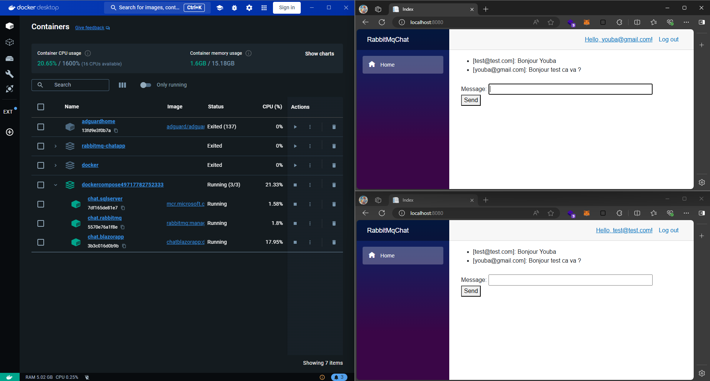

# RabbitMQChat 💬

RabbitMQChat is a simple chat application using RabbitMQ with ASP.NET Core Blazor (.NET 8). This project demonstrates message producers and consumers with RabbitMQ, utilizing Docker for managing the development environment.




## 📝 Prerequisites

- [.NET 8 SDK](https://dotnet.microsoft.com/download/dotnet/8.0)
- [Docker](https://www.docker.com/get-started)
- [RabbitMQ](https://www.rabbitmq.com/download.html)
  
  

## 🐳Running the Project with Docker

### Step 1: Clone the Repository

```sh
git clone git remote add origin https://github.com/YoubaImkf/rabbitMQ-Kafka.git
cd RabbitMQChatApp
```

### Step 2: Build and Run Docker Containers

- You can run the docker compose directly on **VISUAL STUDIO** by setting the docker compose section as start up project.

Or you can execute the following command (but sometimes there is a problem on 'chat.blazo' see *:

```sh
docker compose up -d
```

This command will build the Docker images and start the containers for the application and RabbitMQ.

### *⚠️ Sometimes you need to rerun the chat.blazor service inside the container ⚠️

### Step 3: Access the Application

Once the containers are running, you can access the application at [http://localhost](http://localhost).

RabbitMQ management console can be accessed at [http://localhost:15672](http://localhost:15672) with the default credentials:

- Username: guest
- Password: guest
  
  

## Running the Project without Docker

### Step 1: Clone the Repository

```sh
git clone <repository-url>
cd RabbitMQChatApp
```

### Step 2: Start RabbitMQ

Run this command to spin up the RabbitMQ server locally, using Docker:

```sh
docker run -d --hostname my-rabbitmq-server --name rabbitmq -p 5672:5672 -p 15672:15672 rabbitmq:3-management
```

Start RabbitMQ on your local machine. Ensure it is running on `localhost:15672`.


### Step 3: Update the Connection Settings

If RabbitMQ is running on a different host or port, update the connection settings in `RabbitMQProducer.cs` and `RabbitMQConsumer.cs`.


**RabbitMQProducer.cs**

Actual value : ```HostName : "chat.rabbitmq"```

```csharp
var factory = new ConnectionFactory() { HostName = "localhost" };
```

**RabbitMQConsumer.cs**

```csharp
var factory = new ConnectionFactory() { HostName = "localhost" };
```

### Step 4: Open the Project in Visual Studio

Open `RabbitMQChatApp.sln` in Visual Studio.

### Step 5: Restore NuGet Packages

In Visual Studio, restore the NuGet packages by right-clicking on the solution and selecting "Restore NuGet Packages".

### Step 6: Run the Application

Set the startup project to `RabbitMQChatApp` and run the project by clicking on the "Run" button or pressing `F5`.

### Step 7: Access the Application

Once the application is running, you can access it at [http://localhost:5000](http://localhost:5000).

## Monitoring RabbitMQ

The RabbitMQ management console can be accessed at [http://localhost:15672](http://localhost:15672). Use the default credentials to log in:

- Username: guest
- Password: guest
